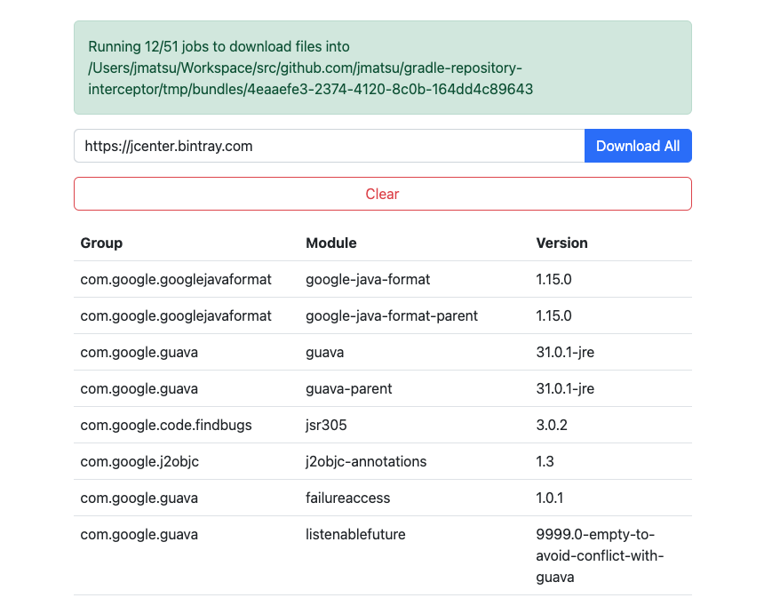
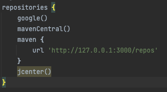
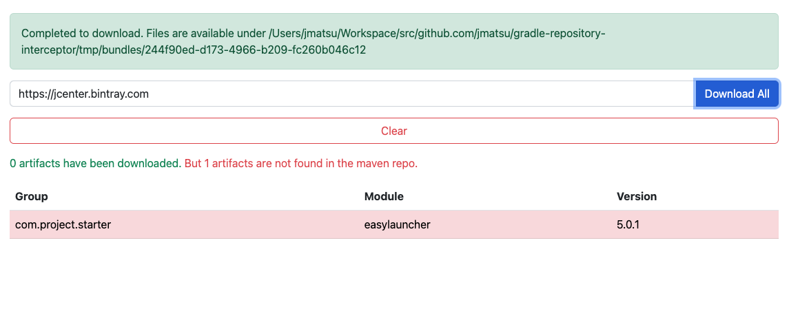

# Maven repository interceptor for Gradle projects



This tool can visualize artifact requests from Gradle projects and download artifacts in bulk.

*Background*

The urgency of JCenter migration is increasing. JCenter is currently working as a read-only repository *indefinitely* as the announcement says but we have seen some issues ever like https://status.gradle.com/incidents/7x4wqd7zv715.

Many people have already migrated when the announcement of JCenter's sunsetting was made, but I know there still be some who have not done it yet. It's time to migrate from JCenter to other repositories and/or libraries, right?
Nevertheless, it is difficult to determine which Maven repository resolves a specific artifact even when using the Gradle API. That's why I've created this tool.

## Usages

After cloning this repository, you have to set up a Rails application environment first. [Dockerfile](#Dockerfile) is also available. 

### Run on local

```bash
bundle install
bundle exec rails s # http://localhost:3000 will be up
```

### Dockerfile

No image is published to any registry for now. You have to build an image on local.

```bash
docker build . -t interceptor
docker run --rm -p 3000:3000 -v $PWD:/app -it interceptor # http://localhost:3000 will be up
```

### Register this tool as a maven repo

And then, you need to just add http://localhost:3000/repos right before the certain maven repository like JCenter.

```gradle
repositories {
  mavenCentral()
  maven { url "http://localhost:3000/repos" }
  jcenter()
}
```



> In the example image above, http://localhost:3000/repos will accept artifact requests that are not found in the both of `google()` and `mavenCentral()`.

### Refresh dependencies of your projects

> Please make sure you are opening http://localhost:3000 on a browser.

Run the following snippet.

```bash
./gradlew dependencies --refresh-dependencies # You may need run other tasks to resolve all artifacts. It depends on your projects.
```

You can see artifact requests on http://localhost:3000.

## Download artifacts as a local maven repository if required

This may be a temporary solution for your projects. This tool can download artifacts from the specific maven repository with keeping the directory structure. 



# References

- https://blog.gradle.org/jcenter-shutdown
- https://jfrog.com/blog/into-the-sunset-bintray-jcenter-gocenter-and-chartcenter/